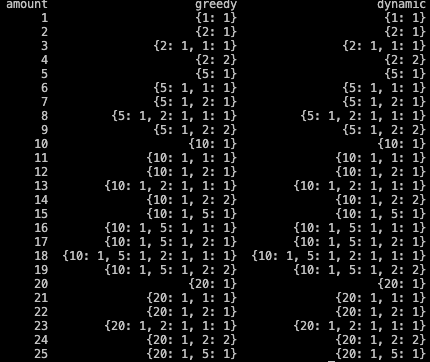

# Conclusions

We observed that the outputs of both algorithms are the same. However, this may not always be the case. The Greedy algorithm does not always provide the most optimal solution. For example, if our coin values were [1, 3, 4] and our amount was 6, we would see that the Greedy algorithm would give a result of {4: 1, 1: 2}, but in fact the solution {3: 2} would be more efficient. Based on Big O Notation, we can determine that the time complexity of the Greedy algorithm is O(n) and the time complexity of Dynamic Programming is O(nm). In this case, n represents the amount and m represents the number of coins. Therefore, Dynamic Programming can generally be more effective for large amounts, but if the number of coins is very large, it can cause performance problems. Both algorithms have their advantages and disadvantages, and the decision on which algorithm to use depends on your usage scenario. No situation that gives a different output with the given coin list has been observed because this list is a "canonical" or standard list. We generally observe situations where the Greedy algorithm does not always provide the most optimal solution when the coin values are not multiples of each other. However, the [1, 2, 5, 10, 20, 50] list is a "canonical" list, so any amount can be formed with these coins. Therefore, for this list, the Greedy Algorithm always provides the most optimal solution. That is, the Greedy algorithm and the Dynamic Programming algorithm give the same results when forming a certain amount with the least number of coins. For example, let's look at the results for an amount of 74: find_coins_greedy(74): {50: 1, 20: 1, 2: 2} find_min_coins(74): {50: 1, 20: 1, 2: 2} Both algorithms form the amount of 74 units using one 50 unit coin, one 20 unit coin, and two 2 unit coins. This shows that both algorithms provide the most optimal solution in this case. However, if the values of the coins are not multiples of each other in a situation or when a certain amount is in question, the results of both algorithms may differ and generally in these situations, the Dynamic Programming algorithm provides more accurate results.
